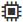
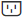

= Visualize o status e as configurações dos componentes da prateleira em SANtricity System Manager
:allow-uri-read: 
:experimental: 
:icons: font
:imagesdir: ../media/

[role="lead"]
A página Hardware fornece o status e as configurações dos componentes do shelf, incluindo as fontes de alimentação, os ventiladores e as baterias.

.Sobre esta tarefa
Os componentes disponíveis dependem do tipo de shelf:

* *Compartimento para unidades* -- Contém um conjunto de unidades de disco, fontes de alimentação/ventoinhas, módulos de entrada/saída (IOMs) e outros componentes de suporte em uma única prateleira.
* *Compartimento do controlador* -- Contém um conjunto de unidades de disco, um ou dois canisters de controlador, canisters de fonte de alimentação/ventoinha e outros componentes de suporte em um único compartimento.

.Passos
. Selecione *Hardware*.
. Selecione a lista suspensa para Controller Shelf ou Drive Shelf e, em seguida, selecione *Exibir configurações*.
+
A caixa de diálogo Configurações dos Componentes da Prateleira é aberta, com guias que mostram o status e as configurações relacionadas aos componentes da prateleira. Dependendo do tipo de prateleira selecionado, algumas guias descritas na tabela podem não aparecer.

+
[cols="25h,~"]
|===
| Aba | Descrição 

 a| 
Compartimento
 a| 
A guia *Shelf* mostra as seguintes propriedades:

** *ID da Prateleira* -- Identifica exclusivamente uma prateleira no array de storage. O firmware do controlador atribui esse número, mas você pode alterá-lo selecionando menu:Shelf[Change ID].
** *Shelf path redundancy* -- Especifica se as conexões entre o shelf e o controlador possuem métodos alternativos (Sim) ou não (Não).
** *Tipos de unidade atuais* -- Mostra o tipo de tecnologia integrada às unidades (por exemplo, uma unidade SAS com capacidade de segurança). Se houver mais de um tipo de unidade, ambas as tecnologias serão exibidas.
** *Número de série* -- Mostra o número de série da shelf.

 a| 
IOMs (ESMs)
 a| 
A aba *IOMs (ESMs)* mostra o status do módulo de entrada/saída (IOM), também chamado de módulo de serviço ambiental (ESM). Ele monitora o status dos componentes em um compartimento de unidades e serve como ponto de conexão entre a bandeja da unidade e o controlador.

O status pode ser Ideal, Falha, Ideal (Conexão Incorreta) ou Não Certificado. Outras informações incluem a versão do firmware e a versão das configurações de configuração.

Selecione *Mostrar mais configurações* para ver as taxas de dados máxima e atual, e o estado da comunicação do cartão (Sim ou Não).

[NOTE]
====
Você também pode visualizar esse status selecionando o ícone IOM , ao lado da lista suspensa Shelf.

====

 a| 
Fontes de alimentação
 a| 
A aba *Fontes de Alimentação* mostra o status do canister da fonte de alimentação e da própria fonte de alimentação. O status pode ser Ótimo, Falha, Removido ou Desconhecido. Também mostra o número de peça da fonte de alimentação.

[NOTE]
====
Você também pode visualizar esse status selecionando o ícone da fonte de alimentação , ao lado da lista suspensa Shelf.

====

 a| 
Ventiladores
 a| 
A aba *Ventiladores* mostra o status do compartimento do ventilador e do próprio ventilador. O status pode ser Ótimo, Falha, Removido ou Desconhecido.

[NOTE]
====
Você também pode visualizar esse status selecionando o ícone de ventilador  ao lado da lista suspensa Prateleira.

====

 a| 
Temperatura
 a| 
A aba *Temperatura* mostra o status da temperatura dos componentes da prateleira, como sensores, controladores e canisters de fonte de alimentação/ventilador. O status pode ser Ótimo, Temperatura nominal excedida, Temperatura máxima excedida ou Desconhecido.

[NOTE]
====
Você também pode visualizar esse status selecionando o ícone de Temperatura image:../media/sam1130-ss-hardware-temp-icon.gif[""], ao lado da lista suspensa Shelf.

====

 a| 
Baterias
 a| 
A aba *Baterias* mostra o status das baterias do controlador. O status pode ser Ideal, Falha, Removido ou Desconhecido. Outras informações incluem a idade da bateria, dias até a substituição, ciclos de aprendizado e semanas entre ciclos de aprendizado.

[NOTE]
====
Você também pode visualizar esse status selecionando o ícone de Baterias image:../media/sam1130-ss-hardware-battery-icon.gif[""], ao lado da lista suspensa Shelf.

====

 a| 
SFPs
 a| 
A aba *SFPs* mostra o status dos transceptores Small Form-factor Pluggable (SFP) nos controladores. O status pode ser Ótimo, Falha ou Desconhecido.

Selecione *Mostrar mais configurações* para ver o número de peça, o número de série e o fornecedor dos SFPs.

[NOTE]
====
Você também pode visualizar esse status selecionando o ícone SFP  ao lado da lista suspensa Prateleira.

====
|===
. Clique em *Close*.

