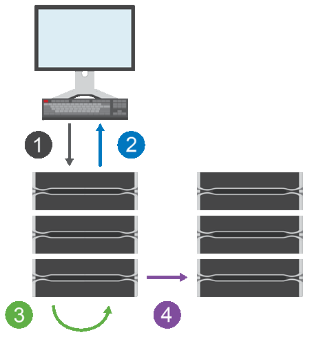

= Como o espelhamento assíncrono funciona no SANtricity System Manager
:allow-uri-read: 
:icons: font
:imagesdir: ../media/

[role="lead"]
O espelhamento assíncrono copia volumes de dados sob demanda ou de acordo com um cronograma, o que minimiza ou evita a interrupção que pode resultar de corrupção de dados ou perda.

O espelhamento assíncrono captura o estado do volume primário em um determinado momento e copia apenas os dados que foram alterados desde a última captura de imagem. O site primário pode ser atualizado imediatamente e o site secundário pode ser atualizado conforme a largura de banda permitir. As informações são armazenadas em cache e enviadas posteriormente, à medida que os recursos de rede se tornam disponíveis.

Esse tipo de espelhamento é ideal para atender à demanda por operações ininterruptas e, em geral, é muito mais eficiente em termos de rede para processos periódicos, como backup e arquivamento. Os motivos para usar espelhamento assíncrono incluem o seguinte:

* Consolidação de backup remoto.
* Proteja contra desastres locais ou de grande escala.
* Desenvolvimento e teste de aplicações em uma imagem pontual de dados ativos.

== Sessão de espelhamento assíncrono

O espelhamento assíncrono captura o estado do volume primário em um determinado momento e copia apenas os dados que foram alterados desde a última captura de imagem. O espelhamento assíncrono permite que o site primário seja atualizado imediatamente e o site secundário seja atualizado conforme a largura de banda permitir. As informações são armazenadas em cache e enviadas posteriormente, à medida que os recursos de rede se tornam disponíveis.

Existem quatro etapas principais em uma sessão de espelhamento assíncrono ativa.

. A operação de gravação ocorre primeiro no array de storage do volume primário.
. O status da operação é retornado ao host.
. Todas as alterações no volume primário são registradas e monitoradas.
. Todas as alterações são enviadas para o array de storage do volume secundário como um processo em segundo plano.

Esses passos são repetidos de acordo com os intervalos de sincronização definidos ou os passos podem ser repetidos manualmente se nenhum intervalo for definido.

O espelhamento assíncrono transfere dados para o local remoto apenas em intervalos definidos, de modo que a E/S local não é afetada significativamente por conexões de rede lentas. Como essa transferência não está vinculada à E/S local, ela não afeta o desempenho do aplicativo. Portanto, o espelhamento assíncrono pode usar conexões mais lentas, como iSCSI, e operar em distâncias maiores entre os sistemas de armazenamento local e remoto.

Os arrays de storage devem ter uma versão mínima de firmware de 7.84. (Cada um pode executar versões diferentes do sistema operacional.)

== Grupos de consistência de espelhamento e pares espelhados

Você cria um grupo de consistência de espelhamento para estabelecer a relação de espelhamento entre o array de storage local e o array de storage remoto. A relação de espelhamento assíncrono consiste em um par espelhado: um volume primário em um array de storage e um volume secundário em outro array de storage.

O array de storage que contém o volume primário geralmente está localizado no site primário e atende aos hosts ativos. O array de storage que contém o volume secundário geralmente está localizado em um site secundário e armazena uma réplica dos dados. O volume secundário normalmente contém uma cópia de backup dos dados e é usado para recuperação de desastres.

== Configurações de sincronização

Ao criar um par espelhado, você também define a prioridade de sincronização e a política de ressincronização que o par espelhado usa para concluir a operação de ressincronização após uma interrupção de comunicação.

Ao criar um grupo de consistência de espelhamento, você também define a prioridade de sincronização e a política de ressincronização para todos os pares espelhados dentro do grupo. Os pares espelhados usam a prioridade de sincronização e a política de ressincronização para concluir a operação de ressincronização após uma interrupção de comunicação.

Os volumes primário e secundário em um par espelhado podem ficar dessincronizados quando o array de storage do volume primário não consegue gravar dados no volume secundário. Essa condição pode ser causada pelos seguintes problemas:

* Problemas de rede entre os arrays de storage local e remoto.
* Um volume secundário com falha.
* Sincronização sendo suspensa manualmente no par espelhado.
* Conflito de função do grupo de espelhamento.

Você pode sincronizar os dados no array de storage no local remoto manualmente ou automaticamente.

== Capacidade reservada e espelhamento assíncrono

A capacidade reservada é usada para monitorar as diferenças entre o volume primário e o volume secundário quando a sincronização não está ocorrendo. Ela também mantém o controle das estatísticas de sincronização para cada par espelhado.

Cada volume em um par espelhado requer sua própria capacidade reservada.

== Configuração e gerenciamento

Para habilitar e configurar o espelhamento entre dois arrays, você deve usar a interface Unified Manager. Depois que o espelhamento estiver habilitado, você pode gerenciar os pares espelhados e as configurações de sincronização no System Manager.
