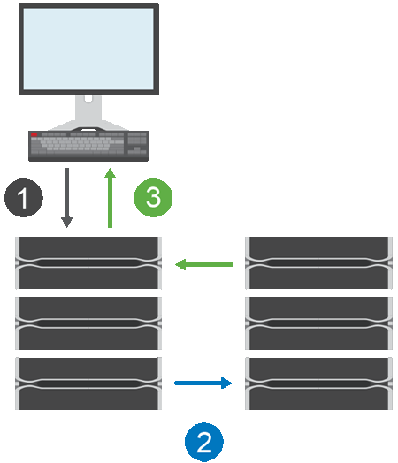

= Como o espelhamento síncrono funciona no SANtricity System Manager
:allow-uri-read: 
:icons: font
:imagesdir: ../media/

[role="lead"]
Espelhamento síncrono replica volumes de dados em tempo real para garantir disponibilidade contínua.

[NOTE]
====
O espelhamento síncrono não está disponível no array de storage EF600/EF600C ou EF300/EF300C.

====
O espelhamento síncrono atinge um objetivo de ponto de recuperação (RPO) de zero perda de dados ao manter uma cópia dos dados importantes disponível caso ocorra um desastre em um dos dois arrays de storage. A cópia é idêntica aos dados de produção em todos os momentos porque cada vez que uma operação de gravação é feita no volume primário, uma operação de gravação é feita no volume secundário. O host não recebe uma confirmação de que a operação de gravação foi bem-sucedida até que o volume secundário seja atualizado com sucesso com as alterações feitas no volume primário.

Esse tipo de espelhamento é ideal para continuidade dos negócios, como recuperação de desastres.

== Relação de espelhamento síncrono

Um relacionamento de espelhamento síncrono consiste em um volume primário e um volume secundário em arrays de storage separados. O array de storage que contém o volume primário geralmente está localizado no site primário e atende aos hosts ativos. O array de storage que contém o volume secundário geralmente está localizado em um site secundário e armazena uma réplica dos dados. O volume secundário é usado se o array de storage do volume primário estiver indisponível devido, por exemplo, a uma interrupção total de energia, um incêndio ou uma falha de hardware no site primário.

== Sessão de espelhamento síncrono

O processo de configuração de espelhamento síncrono envolve configurar volumes em pares. Depois de criar um par espelhado, que consiste em um volume primário em um array de storage e um volume secundário em outro array de storage, você pode iniciar o espelhamento síncrono. As etapas do espelhamento síncrono são mostradas abaixo.

. Uma gravação é recebida do host.
. A operação de gravação é confirmada no volume primário, propagada para o sistema remoto e, em seguida, confirmada no volume secundário.
. O array de storage do volume primário envia uma mensagem de conclusão de E/S para o sistema host _após_ ambas as operações de gravação terem sido concluídas com sucesso.

A capacidade reservada é usada para registrar informações sobre a solicitação de gravação recebida de um host.

Quando o controlador proprietário atual do volume primário recebe uma solicitação de gravação de um host, o controlador primeiro registra informações sobre a gravação na capacidade reservada do volume primário. Em seguida, ele grava os dados no volume primário. Depois, o controlador inicia uma operação de gravação remota para copiar os blocos de dados afetados para o volume secundário no array de storage remoto.

Como o aplicativo host precisa aguardar a gravação ocorrer no array de storage local e através da rede no array de storage remoto, é necessária uma conexão muito rápida entre o array de storage local e o array de storage remoto para manter a relação de espelhamento sem reduzir excessivamente o desempenho de E/S local.

== Recuperação de desastres

O espelhamento síncrono mantém uma cópia dos dados que está fisicamente distante do local onde os dados residem. Se ocorrer um desastre no local primário, como uma interrupção ou uma inundação, os dados podem ser acessados rapidamente a partir do local secundário.

O volume secundário fica indisponível para os aplicativos host enquanto a operação de espelhamento síncrono está em andamento, então, em caso de desastre no array de storage local, você pode realizar o failover para o array de storage remoto. Para realizar o failover, promova o volume secundário à função primária. Assim, o host de recuperação poderá acessar o volume recém-promovido e as operações de negócios poderão continuar.

== Configurações de sincronização

Ao criar um par espelhado, você também define a prioridade de sincronização e a política de ressincronização que o par espelhado usa para concluir a operação de ressincronização após uma interrupção de comunicação.

Se o link de comunicação entre os dois arrays de storage parar de funcionar, os hosts continuam recebendo confirmações do array de storage local, evitando a perda de acesso. Quando o link de comunicação voltar a funcionar, quaisquer dados não replicados podem ser ressincronizados automaticamente ou manualmente para o array de storage remoto.

Se os dados são resincronizados automaticamente depende da política de resincronização do par espelhado. Uma política de resincronização automática permite que o par espelhado resincronize automaticamente quando o link estiver funcionando novamente. Uma política de resincronização manual exige que você retome a sincronização manualmente após um problema de comunicação. A resincronização manual é a política recomendada.

Você pode editar as configurações de sincronização de um par espelhado somente no array de storage que contém o volume primário.

== Dados não sincronizados

Os volumes primário e secundário ficam dessincronizados quando o array de storage do volume primário não consegue gravar dados no volume secundário. Isso pode ser causado pelos seguintes problemas:

* Problemas de rede entre o array de storage local e o array de storage remoto
* Um volume secundário com falha
* Sincronização sendo suspensa manualmente no par espelhado

== Par espelhado órfão

Um volume de par espelhado órfão existe quando um volume membro foi removido de um lado (seja o lado primário ou o lado secundário), mas não do outro lado.

Volumes de pares espelhados órfãos são detectados quando a comunicação entre arrays é restaurada e os dois lados da configuração de espelhamento reconciliam os parâmetros de espelhamento.

Você pode remover um par espelhado para corrigir um estado de par espelhado órfão.

== Configuração e gerenciamento

Para habilitar e configurar o espelhamento entre dois arrays, você deve usar a interface Unified Manager. Depois que o espelhamento estiver habilitado, você pode gerenciar os pares espelhados e as configurações de sincronização no System Manager.
