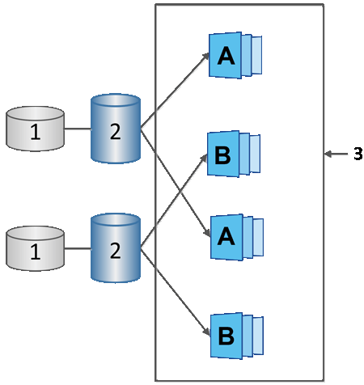

= Saiba mais sobre agendamento do Snapshot e grupo de consistência no SANtricity System Manager
:allow-uri-read: 
:icons: font
:imagesdir: ../media/

[role="lead"]
Utilize agendamentos para a coleta de imagens de Snapshot e grupos de consistência de Snapshot para gerenciar múltiplos volumes base.

Para gerenciar facilmente as operações de Snapshot para volumes base, você pode usar os seguintes recursos:

* *Snapshot schedule* -- Automatize snapshots para um único volume base.
* *Grupo de consistência do Snapshot* -- Gerencie vários volumes base como uma única entidade.

== Agendamento do Snapshot

Se você deseja tirar snapshots automaticamente para um volume base, pode criar um agendamento. Por exemplo, você pode definir um agendamento que tira imagens de snapshot todo sábado à meia-noite, no primeiro dia de cada mês ou em quaisquer datas e horários que você decidir. Após o máximo de 32 snapshots ser atingido para um único agendamento, você pode suspender os snapshots agendados, criar mais capacidade reservada ou excluir snapshots. Os snapshots podem ser excluídos manualmente ou automatizando o processo de exclusão. Após uma imagem de snapshot ser excluída, capacidade reservada adicional fica disponível para reutilização.

== Grupo de consistência Snapshot

Você cria um grupo de consistência de snapshot quando deseja garantir que as imagens de snapshot sejam criadas em vários volumes ao mesmo tempo. As ações de imagem de snapshot são executadas no grupo de consistência de snapshot como um todo. Por exemplo, você pode agendar snapshots sincronizados de todos os volumes com o mesmo timestamp. Grupos de consistência de snapshot são ideais para aplicativos que abrangem vários volumes, como aplicativos de banco de dados que armazenam logs em um volume e os arquivos de banco de dados em outro volume.

Os volumes incluídos em um grupo de consistência de snapshot são chamados de volumes membros. Quando você adiciona um volume a um grupo de consistência, o System Manager cria automaticamente uma nova capacidade reservada correspondente a esse volume membro. Você pode definir um agendamento para criar automaticamente uma imagem de snapshot de cada volume membro.

^1^ Capacidade reservada; ^2^ Volume de membro; ^3^ Imagens de Snapshot do grupo de consistência
