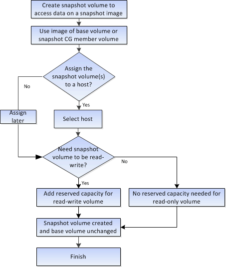

= Como funciona a criação de imagens de snapshot e volumes de snapshot no SANtricity System Manager
:allow-uri-read: 
:icons: font
:imagesdir: ../media/

[role="lead"]
No SANtricity System Manager, você pode criar imagens Snapshot e volumes Snapshot seguindo estes passos.

== Fluxo de trabalho para criação de imagens Snapshot

image::../media/sam1130-flw-snapshots-create-ss-images.gif[Fluxo de trabalho para criar imagens Snapshot]

== Fluxo de trabalho para criação de volumes de Snapshot

